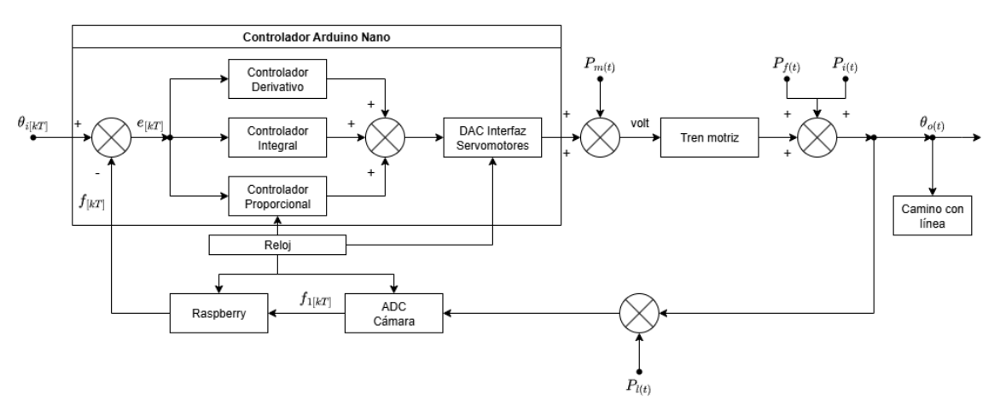

# Sistema de control de un robot seguidor de línea

## Descripción

### Introducción

El presente trabajo se enmarca en el segmento de la automatización y la robótica móvil aplicada a procesos logísticos e industriales. En particular, se aborda el diseño y análisis de un robot seguidor de línea, tecnología comúnmente utilizada en sistemas de transporte autónomo dentro de plantas de manufactura, centros de distribución o entornos educativos para la enseñanza de control y mecatrónica.

### Objetivos

El objetivo de control en este trabajo es lograr que el robot móvil mantenga su trayectoria siguiendo una línea negra sobre un fondo claro, minimizando las desviaciones respecto de dicha línea de guía.

Se busca que el sistema reaccione de forma estable, rápida y precisa ante perturbaciones tales como curvas cerradas, cambios de iluminación o pequeñas imperfecciones en el suelo.

La solución propuesta se basa en un esquema de realimentación donde la información obtenida del entorno es utilizada en tiempo real para ajustar el comportamiento del robot. Para ello, se integra una arquitectura que combina visión artificial y control electrónico, utilizando diferentes componentes de hardware y software que permiten una respuesta eficaz ante los estímulos externos.

### Diagrama de bloques del sistema de control



### Documentación

La documentación del estudio sobre el sistema concreto se puede encontrar en el siguiente enlace: [K4011 - Galli - García Fariñas - 1C° 2025](https://drive.google.com/file/d/1l4xvPurp14ddQ8Ckw8HgPiGAEo9JfE7b/view?usp=sharing)


## Simulación

### Instalación

Para la ejecución de la simulación es necesario instalar las dependencias del archivo `requirements.txt`.

```bash
pip install -r requirements.txt
```

### Ejecución

Para ejecutar la simulación, se debe ejecutar el script `simulacion.py`.

```bash
python simulacion.py
```

En caso de crear un entorno virtual, se debe ejecutar el script `simulacion.py` dentro del entorno virtual.

```bash
python3 -m venv venv

venv/bin/python simulacion.py
```